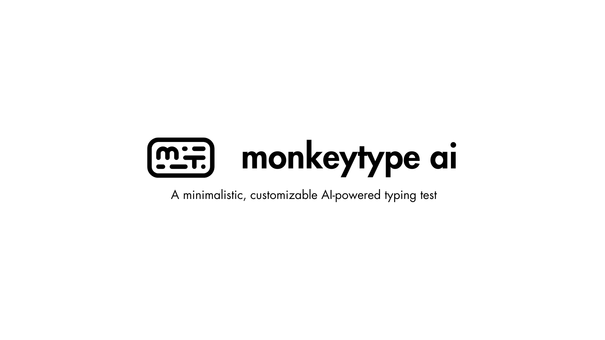

<div align="center" style="padding: 10px; border: 1px solid #ccc; background-color: #f9f9f9; border-radius: 10px; margin-bottom: 20px;">
    <h2 style="margin: 0; font-size: 24px; color: #333;">Monkeytype AI is OUT! 🎉</h2>
    <p style="margin: 5px 0 0 0; font-size: 16px; color: #666;">Read all about it on <a href="" style="text-decoration: underline; color: #1a73e8;"> LinkedIn</a>!</p>
</div>

<!-- markdownlint-disable MD030 -->

# [](https://monkeytypeai.vercel.app/)

<p align="center"><strong>
    A minimalistic, customizable typing test.
</strong></p>
<p align="center" style="font-size: 14px; font-weight: bold;">
    Now AI powered!
</p>
<p align="center" style="font-size: 12px;">
    Powered by Falcon, GPT-4o and AI71 API Hub.
</p>


## 🚀 Watch on YouTube
[


# About

Monkeytype AI is a minimalistic and customizable AI-powered typing test. Adjust user-configurable features such as themes, typing contents and more by simply generating using AI.

Monkeytype AI attempts to emulate a natural typing experience during a typing test by unobtrusively presenting the text prompts and displaying typed characters in place, providing straightforward, real-time feedback on typos, speed, and accuracy. 

When a user makes a typing mistake, the app instantly regenerates the current word, creating a new, correct English word that continues from the mistaken letter. This means users no longer need to stop and correct errors manually, allowing for a smoother and more efficient typing process.


# Current Features

- minimalistic design, with optional advertisements and focus mode while typing
- type what you see, see what you type
- ai generated content with default mode
- live errors, wpm, and accuracy displays
- seemlessly collaborate with ai
- ai generated content with punctuation and numbers, enter what you wish
- a variety of test lengths; 15s, 30s, 45s
- ai generated themes, your imagination matters
- collaborative themes, save yours for everyone
- and much more

## 🎥 Watch the promo videos

### Mistakes are no longer a problem, AI will help you

<p align="center">
<video src='./shorts/promo-typing.mp4' width=720></video>
</p>

### Imagine your own theme, let AI do the rest

[](https://raw.githubusercontent.com/abdibrokhim/monkeytype-ai/main/shorts/promo-theme.mp4)


<p align="center">
<video src='./shorts/promo-theme.mp4' width=720></video>
</p>

### Type on your own content, enter what you wish

<p align="center">
<video src='./shorts/promo-puncts.mp4' width=720></video>
</p>

it's so cool, right?

<p align="center">
<video src='./shorts/promo-nums.mp4' width=720></video>
</p>

if video is not rendered, you can watch them by navigating to `./shorts` folder

# 📦 Get Started

first

clone the repository with:

```shell
git clone https://github.com/abdibrokhim/monkeytype-ai
```

then

install the dependencies with:

```shell
npm install
```
and 

run the development server with:

```shell
npm run dev
```

then

open http://localhost:3000 in your browser.

or 

simply visit [Monkeytype AI](https://monkeytypeai.vercel.app/)

# 🦄 Important 🦄

if you think idea is SUPER CREATIVE. Please consider [donate](https://buymeacoffee.com/abdibrokhim/) and i will buy custom domain for this project.

### Presentation and Live demo [here](https://docs.google.com/document/d/1SORmbdm6TMjlaWby9mJBbT5N97G5yBPOpu29G9bZ05w/edit?usp=sharing)

# 🥂 Discord bot

Join our community Discord server [Open Community](https://discord.gg/nVtmDUN2sR)

# 🐞 Bug report or Feature request

Message me at abdibrokhim@gmail.com

# 👋 Want to Contribute?

Kindly check the [CONTRIBUTING.md](https://github.com/abdibrokhim/monkeytype-ai/blob/main/CONTRIBUTING.md)

# 🙏 Support
If you wish to support further development and feel extra awesome, you can [donate](https://buymeacoffee.com/abdibrokhim/), become a [Patron](https://www.patreon.com/abdibrokhim) or [repost on LinkedIn]().


Inspired by: https://monkeytype.com/ 